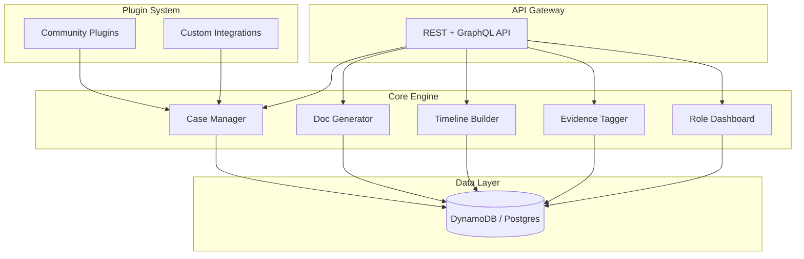

# ⚖️ Justice OS — The Linux of Justice Tech

[](LICENSE)

[](CONTRIBUTING.md)
[](https://github.com/dougdevitre/justice-os/pulls)

**Open-source modular platform for building justice applications.**

---

## The Problem

Justice tech is fragmented. Courts, legal aid organizations, and nonprofits are stuck with siloed systems that don't talk to each other. Expensive proprietary platforms lock out small orgs that need the tools most. There is no interoperability, no shared standards, and no way for the broader community to contribute.

The result: millions of people fall through the cracks of a system that was supposed to protect them.

## The Solution

Justice OS is a modular plugin architecture where any organization can build, share, and deploy justice tools. Think of it as the Linux of justice tech — a shared foundation that anyone can extend.

Build a case manager. Plug in a document generator. Add a timeline builder. Share it with every legal aid org in the country. That's Justice OS.

---

## Architecture



---

## Who This Helps

| Audience | How Justice OS Helps |
|---|---|
| **Legal aid orgs** | Deploy a full case management stack without vendor lock-in |
| **Courts** | Modernize operations with modular, interoperable tools |
| **Nonprofits** | Access free, production-ready justice software |
| **Self-represented litigants** | Benefit from better tools built by the community |
| **Justice tech startups** | Build on a shared platform instead of starting from scratch |

---

## Features

- [ ] Plugin system with hot-reload support
- [ ] Case Manager — track parties, events, deadlines, and outcomes
- [ ] Doc Generator — assemble court documents from templates
- [ ] Timeline Builder — visualize case history and key dates
- [ ] Evidence Tagger — organize and tag exhibits
- [ ] Role Dashboard — judge, attorney, clerk, and litigant views
- [ ] REST and GraphQL API
- [ ] Multi-tenancy support
- [ ] Audit logging

---

## Tech Stack

| Layer | Technology |
|---|---|
| Language | TypeScript |
| Runtime | Node.js |
| API | Express / tRPC |
| Database | DynamoDB + Postgres |
| Testing | Vitest |
| Linting | ESLint + Prettier |
| Build | tsc |

---

## Quick Start

```bash
git clone https://github.com/dougdevitre/justice-os.git
cd justice-os
npm install
npm run dev
```

### Create a Plugin

```typescript
import { JusticePlugin, PluginContext } from '@justice-os/types';

const deadlineNotifier: JusticePlugin = {
  name: 'deadline-notifier',
  version: '1.0.0',
  description: 'Sends SMS reminders 48 hours before court deadlines',

  async onLoad(ctx: PluginContext) {
    // Subscribe to deadline events from the case manager
    ctx.caseManager.on('deadlineApproaching', async (event) => {
      await sendSMS(event.party.phone, `Reminder: ${event.label} is due ${event.date}`);
    });
  },

  async onUnload() {
    // Cleanup resources
  },
};

export default deadlineNotifier;
```

> See [examples/basic-plugin.ts](examples/basic-plugin.ts) for a complete working example.

---

## Roadmap

| Feature | Status |
|---------|--------|
| Plugin system with hot-reload | In Progress |
| Case Manager CRUD operations | In Progress |
| Doc Generator template engine | Planned |
| REST and GraphQL API layer | Planned |
| Multi-tenancy and org isolation | Planned |
| Audit logging and compliance trail | Planned |

---

## Justice OS Ecosystem

This repository is part of the **Justice OS** open-source ecosystem — 12 interconnected projects building the infrastructure for accessible justice technology.

| Repository | Description |
|-----------|-------------|
| [justice-os](https://github.com/dougdevitre/justice-os) | Core modular platform — the foundation |
| [mobile-court-access](https://github.com/dougdevitre/mobile-court-access) | Mobile-first court access kit |
| [vetted-legal-ai](https://github.com/dougdevitre/vetted-legal-ai) | RAG engine with citation validation |
| [court-doc-engine](https://github.com/dougdevitre/court-doc-engine) | TurboTax for legal filings |
| [cognitive-load-ui](https://github.com/dougdevitre/cognitive-load-ui) | Design system for stressed users |
| [multilingual-justice](https://github.com/dougdevitre/multilingual-justice) | Real-time legal translation |
| [justice-api-gateway](https://github.com/dougdevitre/justice-api-gateway) | Interoperability layer for courts |
| [justice-analytics](https://github.com/dougdevitre/justice-analytics) | Bias detection and disparity dashboards |
| [evidence-timeline](https://github.com/dougdevitre/evidence-timeline) | Evidence timeline builder |
| [digital-literacy-sim](https://github.com/dougdevitre/digital-literacy-sim) | Digital literacy simulator |
| [pro-se-toolkit](https://github.com/dougdevitre/pro-se-toolkit) | Self-represented litigant tools |
| [justice-components](https://github.com/dougdevitre/justice-components) | Reusable component library |

> Built with purpose. Open by design. Justice for all.

---

## Contributing

See [CONTRIBUTING.md](CONTRIBUTING.md) for guidelines.

## License

MIT — see [LICENSE](LICENSE).
