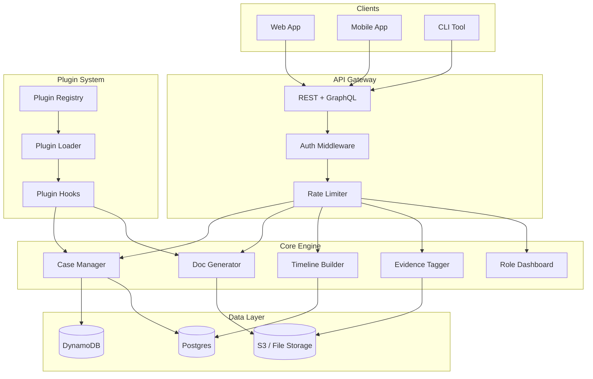
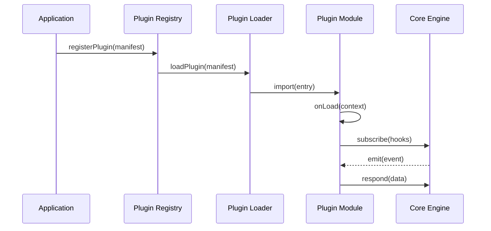
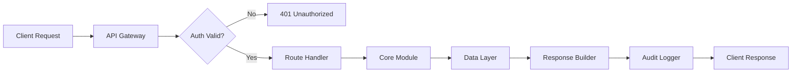
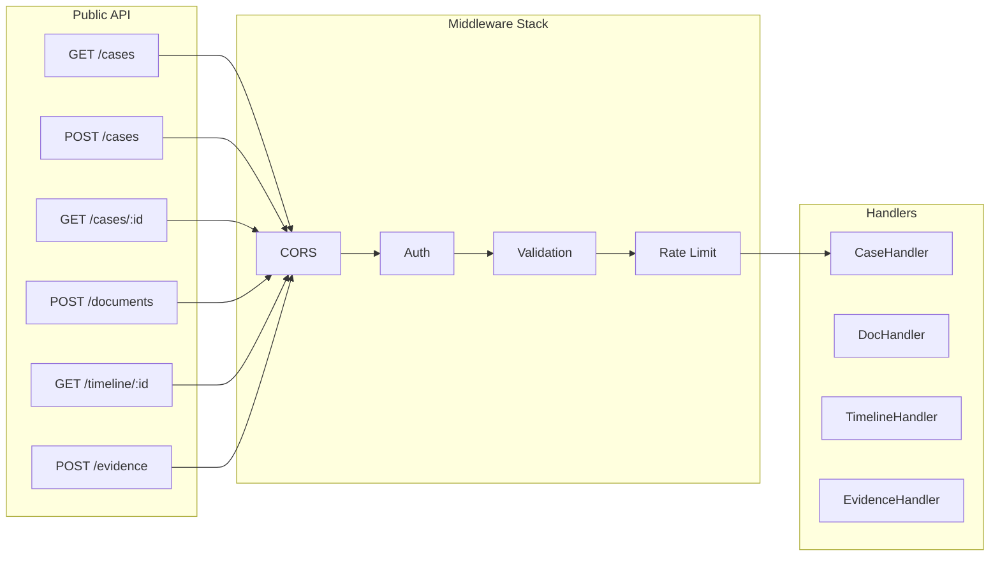

# Justice OS Architecture

## System Overview

```mermaid
graph TD
    subgraph Clients
        WEB[Web App]
        MOB[Mobile App]
        CLI[CLI Tool]
    end

    subgraph API Gateway
        AG[REST + GraphQL]
        AUTH[Auth Middleware]
        RATE[Rate Limiter]
    end

    subgraph Core Engine
        CM[Case Manager]
        DG[Doc Generator]
        TB[Timeline Builder]
        ET[Evidence Tagger]
        RD[Role Dashboard]
    end

    subgraph Plugin System
        PR[Plugin Registry]
        PL[Plugin Loader]
        PH[Plugin Hooks]
    end

    subgraph Data Layer
        DDB[(DynamoDB)]
        PG[(Postgres)]
        S3[(S3 / File Storage)]
    end

    WEB --> AG
    MOB --> AG
    CLI --> AG
    AG --> AUTH
    AUTH --> RATE
    RATE --> CM
    RATE --> DG
    RATE --> TB
    RATE --> ET
    RATE --> RD

    PR --> PL
    PL --> PH
    PH --> CM
    PH --> DG

    CM --> DDB
    CM --> PG
    DG --> S3
    ET --> S3
    TB --> PG
```

## Plugin System

```mermaid
sequenceDiagram
    participant App as Application
    participant PR as Plugin Registry
    participant PL as Plugin Loader
    participant Plugin as Plugin Module
    participant Core as Core Engine

    App->>PR: registerPlugin(manifest)
    PR->>PL: loadPlugin(manifest)
    PL->>Plugin: import(entry)
    Plugin->>Plugin: onLoad(context)
    Plugin->>Core: subscribe(hooks)
    Core-->>Plugin: emit(event)
    Plugin->>Core: respond(data)
```

## Data Flow

```mermaid
flowchart LR
    A[Client Request] --> B[API Gateway]
    B --> C{Auth Valid?}
    C -->|No| D[401 Unauthorized]
    C -->|Yes| E[Route Handler]
    E --> F[Core Module]
    F --> G[Data Layer]
    G --> H[Response Builder]
    H --> I[Audit Logger]
    I --> J[Client Response]
```

## API Layer

```mermaid
graph LR
    subgraph Public API
        R1[GET /cases]
        R2[POST /cases]
        R3[GET /cases/:id]
        R4[POST /documents]
        R5[GET /timeline/:id]
        R6[POST /evidence]
    end

    subgraph Middleware Stack
        M1[CORS]
        M2[Auth]
        M3[Validation]
        M4[Rate Limit]
    end

    subgraph Handlers
        H1[CaseHandler]
        H2[DocHandler]
        H3[TimelineHandler]
        H4[EvidenceHandler]
    end

    R1 --> M1 --> M2 --> M3 --> M4 --> H1
    R2 --> M1
    R3 --> M1
    R4 --> M1
    R5 --> M1
    R6 --> M1
```
